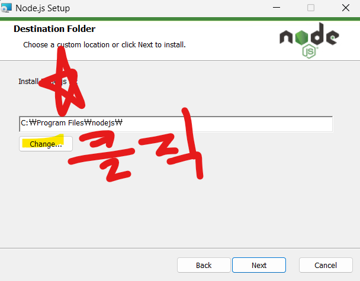
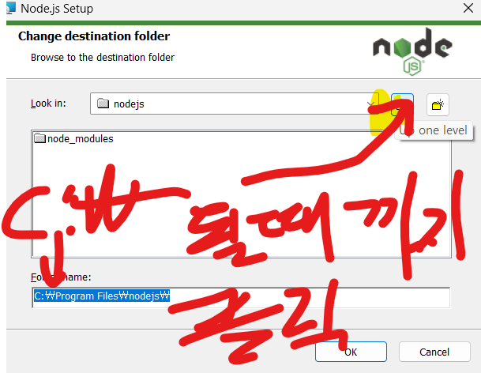
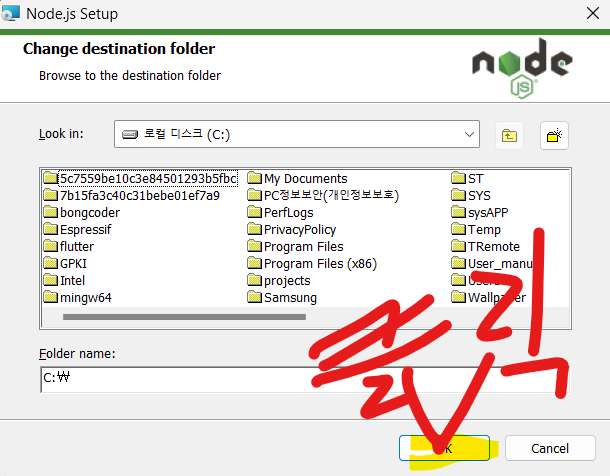

# Bong React Vite Jangin


- [Bong React Vite Jangin](#bong-react-vite-jangin)
  - [링크](#링크)
  - [2024. 11. 21. 목](#2024-11-21-목)
  - [2024. 11. 14. 목](#2024-11-14-목)
    - [if문](#if문)
    - [http 요청 **(GET)**](#http-요청-get)
    - [fetch api](#fetch-api)
    - [Promise](#promise)
    - [async await](#async-await)
    - [응용 겸 숙제!](#응용-겸-숙제)
  - [2024. 11. 7. 목](#2024-11-7-목)
    - [useState](#usestate)
    - [화살표 함수 `()=>{}`](#화살표-함수-)
    - [`<input></input>`태그의 속성 `onChange`](#inputinput태그의-속성-onchange)
    - [useRef](#useref)
    - [object](#object)
  - [2024. 10. 31. 목](#2024-10-31-목)
    - [지난시간 ? 복습](#지난시간--복습)
      - [**React Component**](#react-component)
      - [**Array**](#array)
      - [**Array**의 **메서드** **.forEach()**](#array의-메서드-foreach)
      - [**Array**의 **메서드** **.map()**](#array의-메서드-map)
    - [타입과 메서드](#타입과-메서드)
    - [useState](#usestate-1)
    - [boolean](#boolean)
    - [`<div hidden={true}>`](#div-hiddentrue)
    - [처음 만들어지는 카운터 어쩌고 나도 해보겠습니다.](#처음-만들어지는-카운터-어쩌고-나도-해보겠습니다)
  - [2024. 10. 24. 목](#2024-10-24-목)
    - [지난시간? 인강? 복습](#지난시간-인강-복습)
    - [typescript](#typescript)
    - [Array 와 forEach() map()](#array-와-foreach-map)
    - [useState](#usestate-2)
  - [2024. 10. 17. 목](#2024-10-17-목)
    - [처음 세팅](#처음-세팅)
    - [지난시간 복습](#지난시간-복습)
    - [react component](#react-component-1)
    - [버튼 사용 방법](#버튼-사용-방법)
    - [./src/App.tsx](#srcapptsx)
    - [HTML 태그](#html-태그)
      - [상수](#상수)
      - [타입](#타입)
  - [2024. 10. 10. 목 숙제](#2024-10-10-목-숙제)
    - [github 회원가입](#github-회원가입)
    - [vscode 설치](#vscode-설치)
    - [node.js 설치](#nodejs-설치)
    - [git 설치](#git-설치)
    - [vite로 react 프로젝트 만들기](#vite로-react-프로젝트-만들기)


## 링크

- [예제](https://bong-vite-react-example.pages.dev/)
- [카카오톡오픈채팅](https://open.kakao.com/o/gcyGpNmg)

## 2024. 11. 21. 목

- 게임 만들기?

```tsx
import { useState, useEffect, useMemo } from "react";

const App = () => {
  const [position, setPosition] = useState([0, 1]); // [row, col]
  const myMap = useMemo(() => {
    return [
      ["", "", "", "", "", ""],
      ["▲", "", "", "", "", ""],
      ["■", "■", "■", "■", "■", "■"],
    ];
  }, []);

  // 키보드 이벤트 등록 및 해제
  useEffect(() => {
    // 플레이어 이동 함수
    const movePlayer = (direction: string) => {
      setPosition(([row, col]) => {
        switch (direction) {
          case "up":
            return [Math.max(0, row - 1), col];
          case "down":
            return [Math.min(myMap.length - 1, row + 1), col];
          case "left":
            return [row, Math.max(0, col - 1)];
          case "right":
            return [row, Math.min(myMap[0].length - 1, col + 1)];
          default:
            return [row, col];
        }
      });
    };
    // 키보드 이벤트 핸들러
    const handleKeyDown = (event: KeyboardEvent) => {
      event.preventDefault();
      switch (event.key) {
        case "ArrowUp":
          movePlayer("up");
          break;
        case "ArrowDown":
          movePlayer("down");
          break;
        case "ArrowLeft":
          movePlayer("left");
          break;
        case "ArrowRight":
          movePlayer("right");
          break;
        default:
          break;
      }
    };
    window.addEventListener("keydown", handleKeyDown);

    // 컴포넌트가 언마운트될 때 이벤트 제거
    return () => {
      window.removeEventListener("keydown", handleKeyDown);
    };
  }, [myMap]);

  return (
    <div className="w-fit grid grid-rows-3 ">
      {myMap.map((row, rowIndex) => (
        <div key={rowIndex} className="grid grid-cols-6">
          {row.map((cell, cellIndex) => {
            const isPlayerPosition =
              rowIndex === position[0] && cellIndex === position[1];

            return (
              <div
                key={cellIndex}
                className={` w-8 h-8 flex items-center justify-center ${
                  cell === "■" ? "bg-black text-white" : "bg-gray-200"
                }`}
              >
                {isPlayerPosition ? "★" : cell}
              </div>
            );
          })}
        </div>
      ))}
    </div>
  );
};
export default App;
```

## 2024. 11. 14. 목

### if문

- if는 한국말로 만약임
- `if(조건식){조건식이 true라면 실행할거}`

- 위와 같이 쓴다.
- `true` `false`로 나오는 것은 비교로 많이 한다?
- `a === b` a랑 b 동일합니까? 맞으면 true 아니면 false(javascript에서 `==`도 비슷한 의미인데 그냥 없는걸로 쳐라)
- `a !== b` a랑 b랑 다릅니까? (javascript에서 `!=`도 비슷한 의미인데 그냥 없는걸로 쳐라)
- `a > b` `a < b` 네가 생각하는 그거 맞음. 역시 true false

```ts
//  예시
// 1 === 1 1하고 1은 같습니까? 맞으면 true 틀리면 false임
if (1 === 1) {
  // true임
  console.log("당신은천재입니다");
} // 콘솔 출력됨
if (1 !== 1) {
  // false
  console.log("당신은천재입니다");
} // 콘솔 출력 안됨
```

### http 요청 **(GET)**

- http 요청은 클라이언트가 서버에게 무언가 요청하는 것을 말함.
- 여러 가지 요청 방법 중에서 **GET** **POST**를 많이 씀.
- GET은 클라이언트측에서 브라우저에게 뭔가를 달라는 요청임.
- 웹 브라우저 주소 창에다가 어떤 주소를 입력하고 이동하는 것이 바로 **GET**요청임.
- react get 요청을 하기 위해서 **fetch api**를 사용함.

### fetch api

- JavaScript에서 HTTP 요청을 보내고 응답을 처리하는 데 사용하는 표준 API
- fetch api로 요청 보내는 방법
- `fetch('주소')`

### Promise

- 프로미스는 어떤 **비동기** 작업의 실행 결과를 나타내는 타입.
- pending fulfilled rejected 세 가지 타입을 가진다.
- 지금은 그냥`let 받아온값 = fetch('주소')`와 같은 식으로 쓰면 이 받아온 값이란 변수는 **Promise**라는 것만 기억.

### async await

- Promise의 결과 값은 그냥 일반적인 변수값처럼 가져다 쓰지는 못한다.
- Promise를 벗겨내려면 `await`을 써야 한다.
- `let 받아온값 = await fetch('주소')`
- 근데 `await`을 쓰려면 `async`함수 안에서 써야 한다.
- `async` 함수 선언 방법
- ```tsx
  async function 함수이름() {
    let 결과 = await fetch("주소");
    return 결과;
  }
  let 함수이름2 = async () => {
    let 결과 = await fetch("주소");
    return 결과;
  };
  ```
- async 함수도 Promise를 반환하기 때문에 이걸 일반적인 값으로 바꾸려면 await을 써야함.
- random.org 주소: 아래의 주소에 `GET`요청을 하면 1~100중에서 랜덤으로 숫자를 준다.
  `https://www.random.org/integers/?num=1&min=1&max=100&col=1&base=10&format=plain&rnd=new`

### 예시

```ts
function App() {
  async function getRandomNumber() {
    let fetchUrl =
      "https://www.random.org/integers/?num=1&min=1&max=100&col=1&base=10&format=plain&rnd=new";
    let fetchResponse = await fetch(fetchUrl);
    return fetchResponse;
  }
  return (
    <>
      <h1>랜덤값 콘솔에 출력</h1>
      <button onClick={getRandomNumber}>랜덤숫자주셈</button>
    </>
  );
}
export default App;
```

### 응용 겸 숙제!

1. `useState`를 사용해서 `myNumberA` `myNumberB` `isCorrect` state를 만들기
2. 랜덤으로 1~100까지 숫자를 받아와서 숫자 `return`하는 `getRandomNumber`함수 만들기
3. 앞에서 만든 `getRandomNumber`함수를 실행시켜서 받은 값을 앞서 만든 myNumberA에 저장하고 그 다음 , `getRandomNumber`함수를 실행시켜서 받은 값을 앞서 만든myNumberB state에 저장하는 함수 `makeQuestion` 만들기
4. 어떤 `입력값`을 받아서 `myNumberA + myNumberB`가 `입력값`과 일치하면 `isCorrect` state를 true로 만들고 makeQuestion`함수를 다시 실행`하고 `return;` 만약 일치하지 않으면, `isCorrect` state를 false로 만들고 `return`
5. `isCorrect`가 참이면 `html` 부분에 `<p></p>` 태그 안에 "정답! 다음문제 가겠습니다." 틀리면 "틀렸습니다! 다시 푸세요"를 출력해보자`<p>{isCorrect ? "정답":"오답"}</p>`

```ts
import { ChangeEvent, useCallback, useState } from "react";

const App241114 = () => {
  const [numberA, setNumberA] = useState<number>(0);
  const [numberB, setNumberB] = useState<number>(0);
  const [myAnswer, setMyAnswer] = useState<string>("");
  const [isCorrect, setIsCorrect] = useState<string>("시~작");
  const [consumedTime, setConsumedTime] = useState<number>(0);
  const [isRunning, setIsRunning] = useState<boolean>(false);
  const startTimer = useCallback(() => {
    const timer = setInterval(() => {
      setConsumedTime((prevTime) => prevTime + 1);
    }, 1000);
    return () => clearInterval(timer);
  }, []);
  const getRandomNumber = useCallback(async () => {
    const randomorgUrl = `https://www.random.org/integers/?num=1&min=1&max=100&col=1&base=10&format=plain&rnd=new`;
    const response = await fetch(randomorgUrl);
    const randomNumber = await response.text();
    if (isNaN(Number(randomNumber))) throw new Error("IS_NAN");
    return Number(randomNumber);
  }, []);

  const writeRandomNumbers = async () => {
    if (!isRunning) {
      startTimer();
    }
    const getNumberA = await getRandomNumber();
    const getNumberB = await getRandomNumber();
    setNumberA(getNumberA);
    setNumberB(getNumberB);
    setConsumedTime(0);
    setIsRunning(true);
  };
  return (
    <>
      <h1>덧셈 대회</h1>
      <div>
        <p>문제입니다.</p>
        <p>
          {numberA ?? "??"} + {numberB ?? "??"} ={" "}
          <input
            placeholder="정답입력바람"
            onChange={(event: ChangeEvent<HTMLInputElement>) =>
              setMyAnswer(event.currentTarget.value)
            }
            value={myAnswer}
          ></input>
        </p>
      </div>
      <div>{consumedTime}초 경과</div>
      <div>{isCorrect}</div>
      <div>
        <div>
          <button
            onClick={async () => {
              if (Number(myAnswer) === numberA + numberB) {
                setIsCorrect(
                  `오 정말 대단하군요.${numberA} + ${numberB} 이거 계산하는데 무려 ${consumedTime}초 걸렸습니다. 다음문제 푸세요`
                );
                await writeRandomNumbers();
              } else {
                setIsCorrect("산수이슈발생");
              }
            }}
          >
            {isRunning ? "제출" : "눌려서 시작"}
          </button>
        </div>
      </div>
    </>
  );
};
export default App241114;
```

## 2024. 11. 7. 목

### useState

- 화면을 새로 그릴때도 값은 유지 된다.
- 업데이트 되면 화면을 새로 그린다.
- `let [스테이트, set스테이트] = useState()`
- 업데이트 방법: `set스테이트(바꿀값)`

### 화살표 함수 `()=>{}`

- function으로 쓰는 함수와 거의 똑같음.
- `function`키워드가 없어지고 소괄호와 중괄호 사이에 화살표가 붙는다.
- `function`으로 선언하는 함수와 차이가 있는데 나중에 알아보자.
- 체감되는 가장 큰 차이는 호이스팅임
- 간단하게 쓸 수 있어서 좋다 .^\_^

### `<input></input>`태그의 속성 `onChange`

- `onChange`는 `<button>`의 `onClick`과 비슷함
- `on어쩌구`는 보통 어떤 이벤트를 다루는 속성임
- `onChange`는 input안에 원래 있던 값이 바뀔 때 실행 할 함수를 말함.
- `onChange={함수}`와 같이 쓴다.
- `onChange={함수}`안에 들어갈 함수는 `event`프로퍼티를 받는다.
- 그러니깐 함수의 입 부분에 event라는 것을 먹일 수 있다는 뜻이다.
- 함수가 호출되면 이벤트에 해당하는 것을 알아서 먹인다.
- `event.currentTarget.value`는 현재 인풋 창에 입력된 값을 말한다.
- `onChnage={function(evnet){}}`
- 화살표 함수로 써보면`onChange = {(event)=>{}}`
- 예시
- ```tsx
  function App (){

    return  <div>
              <input onChnage={funciton(event){console.log(evnet.currentTarget.value)}}/>
            </div>

  }
  ```

````

### useRef
- 화면을 새로 그릴 때도 값은 유지 된다.
- 업데이트 되어도 화면을 새로 그리지 않는다.
- `let 내Ref = useRef();`
- 업데이트 방법`내Ref.current =  바꿀값`

### object
- `{}` 안에 들어 있는 값
- `{}` 안에 `키: 값` 쌍을 입력한다.
- object 안에 들어 있는 값에 접근할 때는 `오브젝트이름.키이름`과 같이 한다.
- ```tsx
    let myObejct = {
      키1: "값1",
      키2: "값2",
    }
````

```tsx
import { useRef, useState } from "react";

function App() {
  console.log("render");
  const [inputValue, setInputValue] = useState<string>("");
  const [memoItems, setMemoItems] = useState<any[]>([]);
  const inputRef = useRef<HTMLInputElement>(null);
  const newDemo = {
    title: "안녕하세요",
    content: "내용입니다. 뭐든지 입력하세요",
  };
  return (
    <>
      <label>쓰는칸</label>
      <input
        ref={inputRef}
        // value={inputValue}
        onChange={function (event) {
          setInputValue(event.currentTarget.value);
        }}
      />
      <button
        type="button"
        onClick={function () {
          console.log(memoItems);
        }}
      >
        눌려
      </button>
      <button
        onClick={function () {
          const newItem = {
            title: inputRef.current?.value,
            content: "내용",
          };
          setMemoItems([...memoItems, newItem]);
        }}
      >
        추가하셈
      </button>
      {memoItems.map(function (element) {
        return <div>{element.title}</div>;
      })}
    </>
  );
}
export default App241107;
```

## 2024. 10. 31. 목

### 지난시간 ? 복습

#### **React Component**

- react에서는 여러 component를 블록처럼 조합할 수 있다.
- react의 컴포넌트는 반드시 다음의 요소를 가져야 한다.
- 함수일 것
- return 하는 값이 ReactNode일 것(`<></>` 이 안에 들어가는 것)
- 함수 이름의 첫 글자는 반드시 알파벳 대문자일 것(app x App o)

```tsx
function MyH1Component() {
  return <h1>안녕하십니까.</h1>;
}

function App() {
  return (
    <>
      <MyH1Component></MyH1Component>
    </>
  );
}
```

#### **Array**

- `[값1,값2,값3]` 과 같이 쓴다.

#### **Array**의 **메서드** **.forEach()**

-`Array.forEach();`

```tsx
let myArray: number[] = [1, 2, 3];
let result = myArray.forEach(function (element) {
  console.log(element);
  return element + 1;
});
// 1, 2, 3 차례로 콘솔에 출력됨

console.log(result); // undefined 출력
```

#### **Array**의 **메서드** **.map()**

-`Array.map();`

```tsx
let myArray: number[] = [1, 2, 3];
let result = myArray.map(function (element) {
  console.log(element);
  return element + 1;
});
// 1, 2, 3 차례로 콘솔에 출력됨
console.log(result); // [2,3,4] 출력됨
```

### 타입과 메서드

- typescript(javascript)에는 여러 가지 타입이 있다.
- 대표적인 것은 숫자는 `number` 문자는 `string`
- `Array`는 안에 어떤 타입이 들어가는지에 따라
  - `string[]` `number[]` 등으로 표현할 수 있다.
- 다른 타입도 많지만 일단 당분간 이거 두 가지 외에는 전부 `any`타입으로 표기하자.
- 변수를 선언할 때 타입을 함께 지정할 수 있다.
- 변수이름 뒤 에 `:타입`이라고 하면된다.
- `let 변수이름:타입;`
- ```tsx
  let myNumber: number = 1;
  let myString: string = "hi!";

  let myNumberArray: number[] = [1, 2, 3];
  let myStringArray: string[] = ["a", "b", "c"];
  ```

### 버튼에 함수 넣기

- 버튼의 `onClick={함수}`를 통해서 버튼을 눌렸을 때 어떤 함수를 실행시킬 수 있다.

```tsx
function App() {
  function onButtonClick() {
    console.log("눌려짐");
  }
  return (
    <>
      <button onClick={onButtonClick}>버튼이름</button>
    </>
  );
}
```

- 이 버튼을 누르면 콘솔에 눌려짐이라고 뜬다.
-

### useState

- `useState();`는 리액트의 훅이다.
- 훅=편리한 기능정도로 생각
- 중요 훅으로 `useState` `uesEffect` `useRef` 가 있고 이정도만 알아도 어느정도 okay
- `useState`는 변수랑 거의 똑같은데 단, 이 값이 변하면 화면도 같이 업데이트 되는 변수라고 생각하면 된다.
- `useState()`는 `()`안에 어떤값을 넣어서 초기 state 값을 정해줄 수 있다.
- `let [state이름, setState이름] = useState<타입>(초기값)` 이렇게 쓴ㄷ가.
- state에 저장된 값을 바꿀 때는 `setState(바꿀값)`으로 바꾼다.

```tsx
function App() {
  let [내상태, set내상태] = useState<string>("초기상태");
  function 내상태바꿔(바꿀값: string) {
    console.log(`${내상태}에서`);
    set내상태(바꿀값);
    console.log(`${바꿀값}으로 바뀜 ㅋ`);
  }
  return (
    <>
      <h1>{내상태}</h1>
      <button
        onClick={function () {
          내상태바꿔("꿀꿀함");
        }}
      >
        상태꿀꿀하게
      </button>
      <button
        onClick={function () {
          내상태바꿔("기분좋음");
        }}
      >
        기분좋은상태로
      </button>
    </>
  );
}
```

### boolean

- 새로운 타입!
- boolean
- `true` 또는 `false`
- `let 불리언:boolean = true;`
- `let 불리언:boolean = false;`
- 참 거짓으로 나타낼 수 있다.

### `<div hidden={true}>`

```tsx
function App() {
  let [보이게하기, set보이게하기] = useState<boolean>(true);
  function 숨기는함수() {
    set보이게하기(!보이게하기); // !는 참 거짓을 뒤집는다는거! 참을 거짓으로 거짓을 참으로
  } // 이 함수가 호출되면 보이게하기의 참 거짓이 뒤집힌다.

  return (
    <>
      <div hidden={보이게하기}>내가 보입니까?</div>
      <button onClick={숨기는함수}>보일까말까</button>
    </>
  );
}
```

### 처음 만들어지는 카운터 어쩌고 나도 해보겠습니다.

```tsx
function App() {
  let [카운터, set카운터] = useState<number>(0);
  let 올리는함수 = function () {
    let 새로운숫자: number = 카운터 + 1;
    set카운터(새로운숫자);
  };
  return (
    <>
      <div>버튼 {카운터} 번 눌림</div>
      <button onClick={올리는함수}>눌리기</button>
    </>
  );
}
```

## 2024. 10. 24. 목

### 지난시간? 인강? 복습

### typescript

- 지금까지는 `let 변수:any = 값` 처럼 `any` 타입을 썼는데
- 이제부터는 슬슬 타입을 명시하는 것을 연습하겠습니다.
- 대표 타입!
  - `let 변수:string = "값";`
  - `let 변수:number = 15;`
  - `let 변수:boolean = true` `let 변수:boolean = false`
  - 함수에서는 `function 함수이름():리턴되는거타입` 이런식으로 쓴다.
  - ```tsx
    function 함수이름(먹이: number): number {
      let 결과값: number = 먹이 + 10;
      return 결과값;
    }
    ```

### Array 와 forEach() map()

- 배열은 `[]` 안에 여러가지가 들어 있는 것이다.
- `[요소1, 요소2, 요소3]`과 같이 `,`로 구분한다.
- `.map()` `.forEach()`
- `[요소1, 요소2, 요소3].map( (요소,index  )=>{ return  리턴값;})`
- ```tsx
  let result = ["a", "b", "c"].map(function (요소: string, 순번: number) {
    return `${요소} ${순번}`;
  }); //
  console.log(result);
  ```

### react component

```tsx
function ChildComp1(){
  return (<>
    <h1>comp1</h1>
  </>);
}
// export default Comp1

function ChildComp2(){
  return (<>
    <h1>comp2</h1>
  </>);
}

function ParentComp(){

  return(
    <ChildComp1/>
    <ChildComp2/>
  );
}
```

```tsx
function ParentComp() {
  return <>{[<h1>1번</h1>, <h1>2번</h1>, <h1>3번</h1>]}</>;
}
```

### useState

- react에서는 훅(Hook)이라는 것이 있습니다.
- 잘 쓰면 어려운 기능도 훅훅 (웃음)
-

## 2024. 10. 17. 목

### 처음 세팅

- 컴퓨터 킨다.
- 탐색기
- C:\DOWN 들어가서
- bongcoder.zip 더블클릭
- 안에 내용 복사
- 바탕화면에 붙여넣고
- vscode 오른쪽 클릭 -> 관리자 권한으로 실행
- vscode 열리면 왼쪽 위 file - open folder
- 바탕화면 - bongcoder
- 열리면 <kbd>ctrl</kbd> + <kbd>`</kbd>
- `npm install`
- 다 되면
- `npm run dev`

### 지난시간 복습

- 웹애플리케이션: **인터넷 브라우저**를 통해 실행할 수 있는 소프트웨어
- 인터넷 브라우저: **인터넷 브라우저**는 html, css, javascript 파일을 해석할 수 있다.
- html: 웹애플리케이션 페이지의 구조와 내용을 담은 파일.
- css: 웹애플리케이션의 모양을 바꿀 수 있는 파일
- javascript: 웹애플리케이션의 기능을 담당하는 파일

- react components: **함수** html을 return 한다. (엄밀히 말하면 html은 아님)

- 함수의 구조:

  ```tsx
  function 함수이름(입: any) {
    let 결과값 = 입 + 10;
    return 결과값;
  }
  ```

  ```tsx
  export default function App() {
    function 빵사오는녀석(돈: number) {
      let 빵값: number;
      빵값 = 돈 * 10;
      let 결과: string = `${빵값}원어치빵`;
      return 결과;
    }

    console.log(빵사오는녀석(1000)); // "10000원어치빵" 출력
    return <></>;
  }
  ```

### react component

    - react 컴포넌트는 함수다.
    - react에서 이걸 가져다가 쓸 수 있다.
    - react 컴포넌트는 html(reactNode)을 return한다.
    - react 컴포넌트에서 return하는 html(reactNode)는 `<></>`이걸로 감싸야 한다.
    - 이 함수를 `export default 함수이름`으로 내보내면 출력 가능~

- ```tsx
  function 함수이름() {

    // 여기에 각종 기능

    return(
      <>
        <!-- 여기에 HTML(react Node) -->
      </>
    );
  }
  export default 함수이름;
  ```

- 변수: **let**으로 선언하는, 일종의 박스, 나중에 값을 집어넣거나 바꿀 수 있다.
- 상수: **const**로 선언하는, 일종의 금고. 나중에 값을 바꿀 수 없다.

- react에서 사용하는 html
  - `<></>` react fragment, react에서만 사용하는 일종의 빈 태그. 그냥 당분간 강박적으로 모든 react 컴포넌트는 `<></>`로 시작할 예정
  - `<h1>제목</h1>` h태그는 h뒤에 있는 숫자가 작아질 수록 높은 계층의 제목
  - `<p>문단</p>` p태그는 문단을 말함.

### console.log();

- `console.log()`는 javascript 실행 환경 콘솔에 메시지를 띄우는 함수
- `cosnsole.log(메시지)`의 형태로 쓴다.
- 그런데 javascript에서 글자에 따옴표를 붙이지 않으면 **변수명**을 말하는거니
- 주의할 것
- 예를들면
- ```tsx
  let 내이름 = "봉우리";
  console.log("내이름"); // 콘솔에 내이름 출력
  cosnole.log(내이름); // 콘솔에 봉우리 출력
  ```
- 어떤 것을 실행한 결과라던가 뭐든지 궁금하면 꼭 `console.log()`사용해서 출력해보자

### 버튼 사용 방법

- `function 함수이름(){};`으로 함수를 javascript 부분에 함수를 만들고
- 버튼에 기능을 넣으려면 `<button>버튼이름</button>`으로 버튼을 만들고
- 여기에 `<button onClick={함수이름} >버튼이름</button>` 이렇게 기능을 넣는다.
- ```tsx
  function App() {
    function 버튼누르면되는함수() {
      console.log("버튼눌렸어");
    }
    return (
      <>
        <button onClick={버튼누르면되는함수}>버튼이름</button>
      </>
    );
  }
  export default App;
  ```

### 이번시간에 해볼것.

- react 컴포넌트 만들기
- javascript 부분에 `내이름`이라는 변수 만들고
- `내이름`변수에 "내이름" 저장하기
- `<h1> {내이름} </h1>` 으로 제목 만들어보기
- `<button>콘솔에내이름 출력</button>` 만들고
- 버튼 클릭하면 콘솔에 `내이름` 출력하는 기능 구현하기-

## 2024. 10. 10. 목

> 24학년도 2학기는 React.js를 이용해 간단한 웹 애플리케이션을 만드는 것을 목표로 합니다.

### 웹애플리케이션이란?

> 웹 애플리케이션은 **인터넷 브라우저**를 통해 접근할 수 있는 소프트웨어 어플리케이션이야. 데스크톱 애플리케이션처럼 특정 기기에 설치할 필요 없이 웹 서버에서 작동하고, 유저는 브라우저로 서버에 접속해서 사용할 수 있어. 예를 들어, 구글 문서, 페이스북, 유튜브 같은 것들이 전형적인 웹 애플리케이션이야.

즉, **브라우저**는 웹애플리케이션을 실행해주는 프로그램이고,

우리가 만들 **웹애플리케이션**은 브라우저에서 실행되는 프로그램인거지.

### javascript, html, css

브라우저는 우리가 만들 프로그램을 실행시켜줍니다. 한국인에게는 한국어로 이야기 해야 의사 소통이 원할한 것 처럼 브라우저에게는 브라우저가 알아들을 수 있는 언어로 이야기를 해야 합니다. 브라우저가 알아들을 수 있는 언어는 **javascript**, **html**, **css**입니다.

#### javascript

javascript는 **기능**을 담당합니다.

#### html

html은 웹애플리케이션의 **내용**을 담당합니다.

#### css

css는 웹애플리케이션의 **모양**을 담당합니다.
이 세 가지를 따로 따로 기초부터 배우는 방법도 있지만, 각각의 내용이 방대하고 외울 것이 많기 때문에 효율적이지 않다고 생각합니다.
어린 아이가 한국어의 모든 어휘와 문법을 익히지 않아도 의사소통 할 수 있는 것 처럼, 우리도 우선 브라우저와 javascript, html, css를 사용하여 소통하는 방법일 익힐 것입니다.
그렇기 때문에 이 수업에서는 곧바로 vite로 react.js 프로젝트를 생성하고 간단한 페이지를 만들며 **브라우저와 소통**을 해보겠습니다.
단, javascript는 동적 타입을 사용하여 불편한 점이 있기에 **typescript**를 사용하도록 하겠습니다.

### vite

vite는 프론트엔드 빌드 도구입니다. 간단한 명령만으로도 프론트엔드 프로젝트를 생성하고 적절하게 포장해 줍니다. 성능도 뛰어나 vite는 빛과 같습니다?

### React.js

react.js는 META(페이스북)이 만든 웹 프론트엔드 프레임워크입니다. 성능이 무척 뛰어나고 새로고침 없이도 화면을 동적으로 생성하는 Single Page Application 형태의 앱을 만들 수 있어 아주 널리 쓰이는 프레임워크입니다.

### 프로젝트 시작하기

VSCode에서 <kbd>ctrl</kbd> + <kbd>`</kbd>를 입력해 터미널을 엽니다.
아래 명령어를 복사하여 붙여넣고 <kbd>enter</kbd>키를 입력합니다.

```bash
npm create vite@latest
```

```bash
# 처음에 나오는거
Need to install the following packages:
create-vite@5.5.3
Ok to proceed? (y) y # y입력
> bong-react-vite-jangin@0.0.1 npx
> create-vite
√ Project name: ... vite-project  # 원하는 프로젝트 이름 입력하고 enter
? Select a framework: » - Use arrow-keys. Return to submit.
    Vanilla
    Vue
>   React # React 선택
    Preact
    Lit
    Svelte
    Solid
    Qwik
    Others
? Select a variant: » - Use arrow-keys. Return to submit.
    TypeScript # 선택?
>   TypeScript + SWC # 또는 선택 (추천 - 좀 더 빠를지도?)
    JavaScript
    JavaScript + SWC
    Remix ↗
```

- 터미널에서 `npm install` 입력하고 <kbd>enter</kbd>
- `.\[내 폴더]\src\index.css` 안의 모든 글자를 지우고 저장한다. (내용만 삭제)
- `.\[내 폴더]\src\App.css`파일을 삭제한다. (파일 자체 삭제)
- `.\[내 폴더]\src\App.tsx`를 실행하고 안에 있는 모든 글자를 다 삭제한다.

### ./src/App.tsx

기본적인 React 컴포넌트는 아래와 같이 만든다. 곤충과 흡사하게 React 컴포넌트도 머리 가슴 배 세 부분으로 나눌 수 있다.

```tsx
// 머리
export default function App() {
  // 가슴
  return (
    // 배
    <>
      <h1>안녕, 나는 봉우리코더.</h1>
    </>
  );
}
```

각 부분 살펴보기

- 머리
  ```tsx
  export default function App() { // 여기까지 머리
  ```
  - `export` 내보낸다는 말
  - `default` import 하면 이거 기본으로 간다는거
  - `function App(){}` javascript 및 typescript의 함수
  - 나중에 설명하겠지만 react의 컴포넌트는 사실 javascript 함수다.
  - 함수란? 간단히 말하면 뭔가를 먹이면 => 소화시키고 => 남긴다. 이런 작동을 하는데
  - `App`이 이 함수의 이름이다. 대충 얼굴.
  - `()`이게 입
  - `{}`이게 배
  - `return()`이 항문이라고 생각하면 이해하기 쉽다.
  - `function`은 이런 종족? 같은걸 말하는데 즉, `App`이라는 기계한테 `()`모양 입에 뭔가를 먹이면 `{}`여기에서 어떻게 소화가 되어서 `return()`모양의 뭔가를 남긴다.
  - 해석하면 누가 이 파일을 import 하면 기본적으로 `App`이라는 함수가 실행되고
  - 이 함수는 `()`일단 아무것도 안먹고
  - `{}` 딱히 소화를 위해서 하는건 없지만
  - `return()`안에 있는 `<><h1>안녕, 나는 .</h1></>`이것을 남기는 함수라는 것.
- 가슴
  ```tsx
  export default function App(){  // 머리
    // 이 부분이 가슴
    // 부분으로 javascript(사실 typescript)
    // 코드를 작성한다.
    return (
  ```
  - 앞서 설명한 것 처럼 `App`이라는 이름의 함수가`()`뭔가 먹고 `{}`에서 소화를 시킨다.
- return()
  - `return()`은 함수가 실행되고 나면 그 자리에 남기는 것이다.
  - `App`이라는 함수는 `<><h1>안녕, 나는 .</h1></>`이것을 남기는데 이것은 HTML 태그다. React 컴포넌트는 HTML 태그를 남겨야 한다. 단 React에서는 이 태그들의 최상위 태그가 병렬이 되어서는 안된다.

### HTML 태그

간단하게 HTML 태그 연습을 하겠다.

- `<></>` React Fragment라고 한다. 사실 HTML 태그는 아니고 React에서만 사용하는 특수한 태그다. React 컴포넌트의 `return()` 안에 들어가는 html 태그는 반드시 1개의 최상위 태그를 가져야 한다. 그렇기 때문에 후술할 `<div></div>` 등의 태그가 의미 없이 사용되지 않게 대신 최상위 태그로 사용되고는 한다.
- `<h1></h1>` `<h2></h2>` `<h3></h3>` 제목 태그이다. h 뒤의 숫자가 커질 수록 하위 제목이 된다. html 태그는 여는 태그와 닫는 태그를 가지는데 `<h1></h1>`을 예로 들면
- `<h1>`이 여는 태그 `</h1>`이 닫는 태그이다.
- 여는 태그와 닫는 태그 사이에는 내용물이 들어간다. 위의 예시에서는 `안녕하세요` 등의 글자를 집어넣었다.
- ```tsx
  exrpot default function App (){
    return(
      <h1>
        <!-- 내용물 자식요소라고도 하고 뭐 그런다.  -->
        안녕하세요
      </h1>
    )
  }
  ```
  위의 HTML은 최상위 제목으로 "안녕하세요"를 사용한 문서를 만든 것이다.

#### 실습

##### 241008

[241008 예시](https://bong-vite-react-example.pages.dev/241008)

- h태그
  1. 큰 제목: `<h1> 제목</h1>`
  2. 덜 큰 제목: `<h2> 제목<h2>`
- p태그
  - `<p> 문단 </p>`
  - 문단을나타내는 태그
- div태그
  - `<div> 내용 </div>`
  - division 그러니까 뭐 간단하게 박스 비슷한 것.
- input 태그
  - `<input></input>`
  - 글자 등 입력을 받는 태그
- button 태그
  - `<button></button>`
  - 누르면 뭔가 기능을 하는 버튼

### 변수, 상수, 타입

- javascript에서는 변수와 상수를 저장할 수 있다.
- 변수: 박스, 안에 뭔가 넣고 뺄 수 있다.
- 상수: 금고, 딱 한 번만 선언할 수 있고 바꿀 수 없다.

#### 변수

변수는 다음과 같이 선언할 수 있다. `let 변수명:타입 = 값`

```tsx
// 예시
let a = 1;
let b: number = 1;
let c: string = "울산중앙중";
let d: boolean = true;
// 다음 주 까지는 잘 모르겠으면 타입에 any를 쓰자
let e: any = 1;
```

> `var`라는 것을 사용할 수 도 있는데 이건 그냥 당분간 잊어버리자.
> 한 번 선언한 변수는 나중에 바꿀 수 도 있다. 바꾸는건 let 빼고 이전에 선언한 변수명만 부르면 된다. `변수명 = 바꿀값`

```tsx
let a = 1;
console.log(a); // 1 출력
a = 2; // 이제 a는 2다.
console.log(a); // 2출력
let b: number = 3; // b에 3 할당 그런데 숫자만 가능
console.log(b); // 3출력
b = 4; // 이제 4
console.log(b); // 4출력
b = "이름"; // 오류남 왜? 숫자만 가능한데 문자열(string) 넣음
let c: any = "이름";
console.log(c); // "이름" 출력
c = true; // 불리언 boolean 타입 true로 바꿈
console.log(c); // true 출력됨
// 이렇게 any를 쓰면 타입을 아무거나 집어넣어도 일단 오류가 안나고 실행은 가능하다. 그런데 문제가 있다. 뭐냐면 타입이 지맘대로 바뀌어도 모르는기 때문이다. ㅠㅠ. 일단 실행은 가능하다고 했지 잘 될거라곤 안했기 때문이다.
```

#### 상수

바뀌지 않는 값이다. 그래서 constant에서 `const a:number = 1;`이렇게 선언한다.

```tsx
const a = 1;
const b: number = 1;
const a = 2; // 바로 오류 발생 왜? 바꾸려고 했으니까
```

#### 타입

많은 경우 특정한 형식의 데이터를 받아서 처리를 해야하기 때문에 어떤 형식의 데이터가 들어가고 나가는지는 중요하다. 예를들어 숫자를 무조건 10 더해주는 함수가 있다고 치자. 그런데 이 함수에다가 "나는 스파이더맨" 이라고 넣으면 어떻게 될까? "나는 스파이더맨" + 10 = ?? 오류를 발생시킬 수 있다. javascript는 "나는스파이더맨10"을 출력하겠지만 그건 오류를 발생시키지 않는다는거지 함수가 내가 의도한 원래 들어온 값에 10을 더한 값을 출력한다는 의도에 맞게 작동한건 아니다. 그러니깐 어떤 선생님이 1~10 페이지 문제 풀어오세요 했는데 답지를 보고 했다면 그건 문제에 답을 쓴 것이지만 풀며 자신의 실력을 점검하고 학습을 하라는 의도가 지켜지지 않은 것이다. 그래서 요즘은 상당히 많은 경우 typescript를 쓴다. typescript는 javascirpt가 가지는 동적 타입이라는 단점을 극복하고자 microsoft에서 개발한 언어로 ... 자세한 내용은 youtube 등에 많이 있으니 한 번 찾아보길 바란다.
자주 쓰는 몇 가지 타입에 대해서 설명하겠다.

```tsx
// number
// 말 그대로 숫자를 말한다.
let myNumber: number = 1;
// string
// 문자열을 말한다.
// '문자' 또는 "문자" 이렇게 따옴표로 묶는다.
let myString: string = "문자열";
// boolean
// true 또는 false
let myBool: boolean = true;
// array
// 여러 값들을 모아놓은 것
// 순서가 있다.
// 배열 안에 특정한 타입의 값을 넣고 싶으면 타입을 지정해주는데
// :Array<T> T 안에 원하는 타입을 넣는다.
let myArray = [1, 3, "학생"]; // 이렇게 하는 것은
let myAnyArray: Array<any> = [1, 3, "학생"]; // 과 같다.
let myNumberArray: Array<number> = [1, 3, 4, 5, 6, 6]; // 숫자 말고 다른거 뜰어가면 오류뿜뿜
// 객체
// 객체지향 어쩌구 할때 객체랑은 조금 다르니 약간 상식적으로 알기만 하자 ?
// 보통 객체 지향 어쩌구는 class로 나중에 배울 수 잇다.
// 아무튼 그렇다고 아주 객체지향 어쩌구가 아닌건 아니고
// 말하자면 뭐든지 담을 수 있는 이름표 있는 서랍이라고 보면 된다.
// 객체의 타입은 나중에 알려주겠다.
let myObject = {
  keyOne: "키원",
  keyTwo: 2,
  keyThree: true,
};
console.log(myObject.keyOne); // "키원"출력
console.log(myObject.keyTwo); // 2 출력
myObject.keyTwo = 3;
console.log(myObject.keyTwo); // 3 출력
// undefined와 null
// undefined는 그 값이 정의되지 않은 경우
// null은 값이 정의는 된거 같은데 비어있는 경우를 말한다.
let undef: undefined = undefined;
let myNull: null = null;
// 이런식으로 선언을 하는 경우는 보통 없고 일반적으로 위에 객체에서
let myObject = {
  keyOne: "키원",
  keyTwo: 2,
  keyThree: true,
  keyFive: null,
};
console.log(myObject.keyFour); // undefined 출력
console.log(myObject.keyFive); // null 출력
let myArray = [1, 2, , , null];
console.log(myArray[3]); // undefined 출력
console.log(myArray[4]); // undefined 출력
console.log(myArray[5]); // null 출력 의도적으로 비움
let myWord = "hi";
console.log(myWard); // undefined 출력
```

## 2024. 10. 10. 목 숙제

### github 회원가입

- [github](https://github.com/)

### vscode 설치

- [vscode 홈페이지](https://code.visualstudio.com/)
- 적절한 버튼 눌려서 다운로드 (팁: 우측 위에 있음)

### node.js 설치

- [node.js 홈페이지](https://nodejs.org/en)
- 홈페이지의 Download Node.js(**LTS**) // 꼮 LTS
- 설치 파일 실행
- 
- 
- 
- 다음 연타!!
- Node.js 는 설치 완료 후 꼭 **재부팅** 할 것

### git 설치

- [git 홈페이지](https://git-scm.com/)
- Download for windows 찾아서 클릭
- **64-bit Git for Windows Setup** 클릭
- 설치 파일 실행시킴
- 다음 다음 누르다가
- 꼭! default editor 어쩌구 나오면
- **vscode** 선택 꼮ㄱ(insider 어쩌구 아니고 그냥 vscode로 찾아야함)
- 저거 빼곤 다 기본값으로 하면 됩니다.

### vite로 react 프로젝트 만들기

VSCode에서 <kbd>ctrl</kbd> + <kbd>`</kbd>를 입력해 터미널을 엽니다.
아래 명령어를 복사하여 붙여넣고 <kbd>enter</kbd>키를 입력합니다.

```bash
npm create vite@latest
```

```bash
# 처음에 나오는거
Need to install the following packages:
create-vite@5.5.3
Ok to proceed? (y) y # y입력
> bong-react-vite-jangin@0.0.1 npx
> create-vite
√ Project name: ... vite-project  # 원하는 프로젝트 이름 입력하고 enter
? Select a framework: » - Use arrow-keys. Return to submit.
    Vanilla
    Vue
>   React # React 선택
    Preact
    Lit
    Svelte
    Solid
    Qwik
    Others
? Select a variant: » - Use arrow-keys. Return to submit.
    TypeScript # 선택?
>   TypeScript + SWC # 또는 선택 (추천 - 좀 더 빠를지도?)
    JavaScript
    JavaScript + SWC
    Remix ↗
```

- 터미널에서 `npm install` 입력하고 <kbd>enter</kbd>
- `.\[내 폴더]\src\index.css` 안의 모든 글자를 지우고 저장한다. (내용만 삭제)
- `.\[내 폴더]\src\App.css`파일을 삭제한다. (파일 자체 삭제)
- `.\[내 폴더]\src\App.tsx`를 실행하고 안에 있는 모든 글자를 다 삭제한다.

- `./src/App.tsx`에
  - App 이라는 이름의 react 컴포넌트 만들기
  - myName이라는 any 타입 변수 만들고 "이름쓰세요"저장
  - 저장된 myName 변수를 진짜 자기이름으로 변경
  - myName 변수를 console.log()로 출력
  - html 부분에서 `<h1></h1>` 태그로 myName 변수가 해당 페이지 나오게 하기.
  - hint: javascript 부분에서 선언한 변수 또는 상수의 이름을 `{}`안에 넣으면 html 부분에서 사용 가능하다.
    - ```tsx
      export default function App() {
        let titleName: string = "제목입니다";
        return <h1> {titleName} </h1>;
      }
      ```
- [과제제출](https://forms.gle/BD7ungbiGpnR2HmF9)
- App.tsx 파일을 위 링크에 첨부하여 업로드 하세요.
